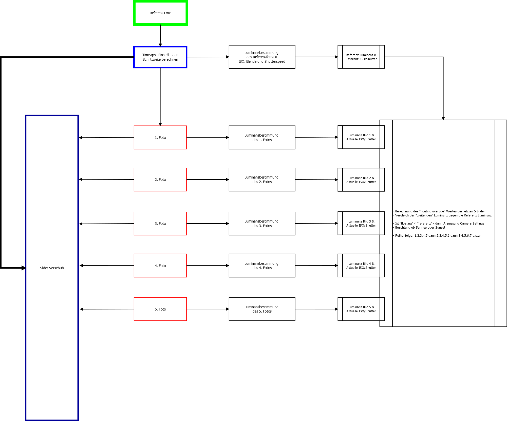

# Ideensammlung und Notizen

Folgende Dinge sollen mit den Scripten abgedeckt werden:
* Steuerung des Sliders
* Steuerung der Camera (Nikon, Canon über gPhoto, meine Olympus über eigene Scripte)
* Belichtungsmessung und Aufnahme Anpassung für bessere Timelapse Source Bilder (Holy Grail Technologie?)

Das Ganze soll nach einmaligem Setup autark laufen und so weit wie möglich vom Stromnetz unabhängig.
Die Steuerung soll im ersten Step über die CLI erfolgen, ein Webinterface könnte ggf. nachträglich zugefügt
werden.



## 120cm Slider und Schrittmotor
Der Schrittmotor braucht für meinen 120cm Slider genau 12970 Schritte. In der schnellsten Steuerungseinstellung
benötigt er dafür 3,8 Minuten. In dem Script [slider.py](https://github.com/tbrumm/SliderTimelapse/blob/master/doc/src/slider.py) sind folgende Einstellungen anzupassen:

* [Detailierte Erklärung zum Schrittmotor](http://www.elektronx.de/tutorials/schrittmotorsteuerung-mit-dem-raspberry-pi/)

### Geschwindigkeit

Der schnellst mögliche Wert scheint 0.005 sec zu sein. Je größer der Wert, desto langsamer der Slider.

```python
# Zeit fuer Pause zwischen den Vorgaengen
time = 0.005
```

### Drehrichtung

Mit dieser FOR Schleife werden die einzelnen Spulen des Schrittmotors angesprochen. Ein rückwärtiges aufrufen des Scriptes, erzwingt dann auch eine Rückwärtsbewegung.

#### Vorwärts

```python
# Volle Umdrehung sind 512 Schritte  
for i in range (12970):
    Step1()
    Step2()
    Step3()
    Step4()
    Step5()
    Step6()
    Step7()
    Step8()  
    print i
```
#### Rückwärts

```python
# Volle Umdrehung sind 512 Schritte
for i in range (12970):
    Step8()
    Step7()
    Step6()
    Step5()
    Step4()
    Step3()
    Step2()
    Step1()
    print i
```

## Gphoto und Timelapse

* Timelapse Berechnung für Sunrise/Sunset mittels Astro::Sunrise Module

## Luminanzbestimmung

* [Luminanzberechnung](https://github.com/tbrumm/SliderTimelapse/blob/master/doc/Luminanz-Calc.md)

## gPhoto2 und Perl

* [gphoto2::Control](https://github.com/plusyan/perl/blob/master/modules/gphoto2/control.pm)

## GPIO with Perl

* [GPIO Examples with Perl](http://elinux.org/RPi_GPIO_Code_Samples#Perl)

### Software

* [gphoto2 Timelapse](https://github.com/jflalonde/gphoto2-timelapse)
* [RPI Timelapse Controller](http://blog.davidsingleton.org/raspberry-pi-timelapse-controller/)
* [LRTimelapse Pro Free Timer - GWegner](https://github.com/gwegner/LRTimelapse-Pro-Timer-Free)
* [Timelapse Deflicker](https://github.com/cyberang3l/timelapse-deflicker)
* [Steuerung der Olympus Air A01](https://github.com/joemcmanus/a01)
* [Sunrise/set](http://search.cpan.org/~jforget/Astro-Sunrise-0.96/lib/Astro/Sunrise.pm)
