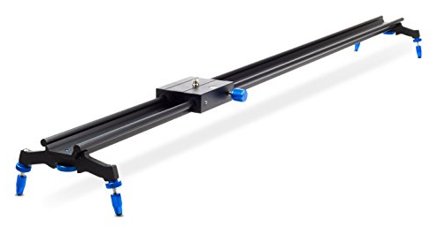
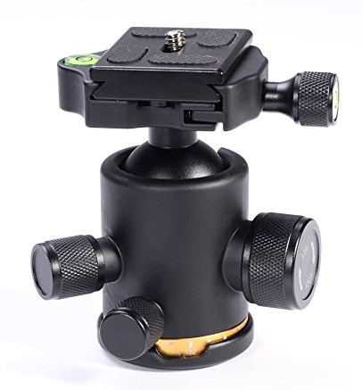
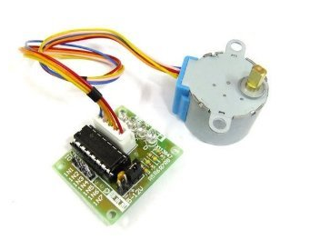
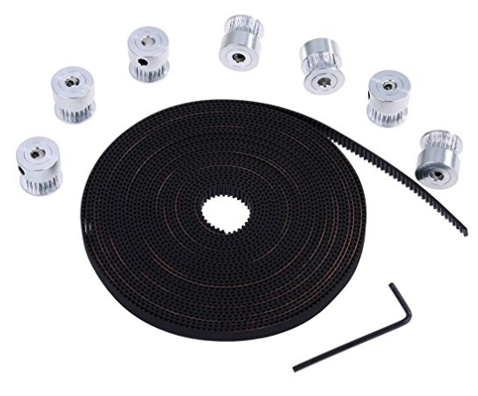

Liste mit benötigten/verwendeten Teilen

- HAUSER & PICARD Kamera Slider "Kimahri" 120 cm (47‘‘) by eSmart 
  (https://www.amazon.de/gp/product/B00NGJZBRO/ref=oh_aui_detailpage_o01_s00?ie=UTF8&psc=1)
  

  
- 12Kg Stativkopf Aluminium Kamera Stativ Kugelkopf mit 1/4'' Schnellwechselplatte für DSLR Kamera
  (https://www.amazon.de/gp/product/B01LVV2LXJ/ref=oh_aui_detailpage_o06_s00?ie=UTF8&psc=1)
  

  
- 28BYJ-48 28BYJ48 DC 5V 4-Phase 5-Wire Arduino Stepper Motor with ULN2003 Driver Board
  (https://www.amazon.de/gp/product/B00ATA5MFE/ref=oh_aui_detailpage_o00_s00?ie=UTF8&psc=1)
  

  
- Anpro 6M GT2 Zahnriemen mit 7x 5mm Riemenscheiben 20 Zähne Bohrung
  (https://www.amazon.de/gp/product/B06Y67NCZL/ref=oh_aui_detailpage_o00_s00?ie=UTF8&psc=1)
  

  
- EasyAcc 20000mAh Outdoor Power Bank mit IP67 Zertifizierung
  (https://www.amazon.de/gp/product/B01B73I5ZU/ref=oh_aui_detailpage_o01_s00?ie=UTF8&psc=1)
  
- vhbw Kamera-Netzteil Ladegerät passend für CANON EOS 550D, 650D, 700D
  (https://www.amazon.de/gp/product/B00491DK8A/ref=oh_aui_detailpage_o00_s00?ie=UTF8&psc=1)
  
- Raspberry Pi 896-8660 All-in-One Desktop PC "3 Modell B Prozessor"
  (https://www.amazon.de/Raspberry-Pi-Prozessor-Quad-Core-cortex-a53/dp/B01CD5VC92/ref=sr_1_1?ie=UTF8&qid=1504858104&sr=8-1&keywords=Raspberry+pi)
  
- EDIMAX EW-7811UN Wireless USB Adapter, 150 Mbit/s, IEEE802.11b/g/n
  (https://www.amazon.de/EDIMAX-EW-7811UN-Wireless-Adapter-IEEE802-11b/dp/B003MTTJOY/ref=sr_1_1?ie=UTF8&qid=1504858112&sr=8-1&keywords=edimax)
  
- SanDisk Ultra Android microSDHC 32GB bis zu 80 MB/Sek, Class 10 Speicherkarte
  (https://www.amazon.de/gp/product/B013UDL5RU/ref=oh_aui_detailpage_o03_s00?ie=UTF8&psc=1)
  
- Neuftech 40x 20cm "female female" "male female" "male male" jumper wire kabel Steckbrücken
  (https://www.amazon.de/gp/product/B00QV7O052/ref=oh_aui_detailpage_o02_s00?ie=UTF8&psc=1)

