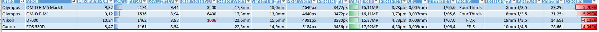

# Gedanken zur Timelapse Steuerung

## Sunrise
* Aus der Nacht kommende Lange Belichtungen
* Hohe ISO Werte am Anfang
* ISO Step by Step verringern
* Belichtungszeiten Step by Step verringen

## Daytime

## Sunset

## Nighttime (Stars)

* Belichtungen bei offener Blende (max)
* Hohe ISO Werte (Schwarzbild?)
* Lange Belichtungszeiten (500er Rule oder [NPF Rule](https://petapixel.com/2017/04/07/npf-rule-formula-sharp-star-photos-every-time/))

